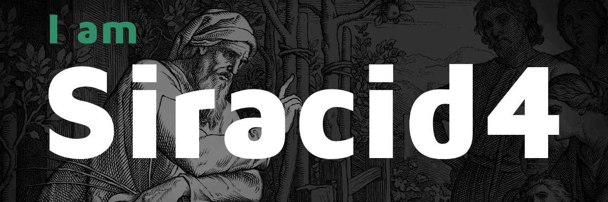

# Hi there, I'm Siracid4 👋  

## ✨ About me
- 💜 **Interests**: I’m deeply interested in technology, engineering and arts.
- 💻 **Learning**: C Language and Web Development.
- 🧠 **Building**: Strong programming foundations.
- 🚀 **Goal**: Become a solid and consistent developer.

## 📈 Github stats

    

    
    

## 📌 Projects & Code

- [C Learning - covering the basic topics of C Language](https://github.com/siracid4/c-learning)
- [The C Programming Language (K&R) - exercises from the book](https://github.com/siracid4/the-c-programming-language-solutions)
- [All repositories](https://github.com/siracid4?tab=repositories)

